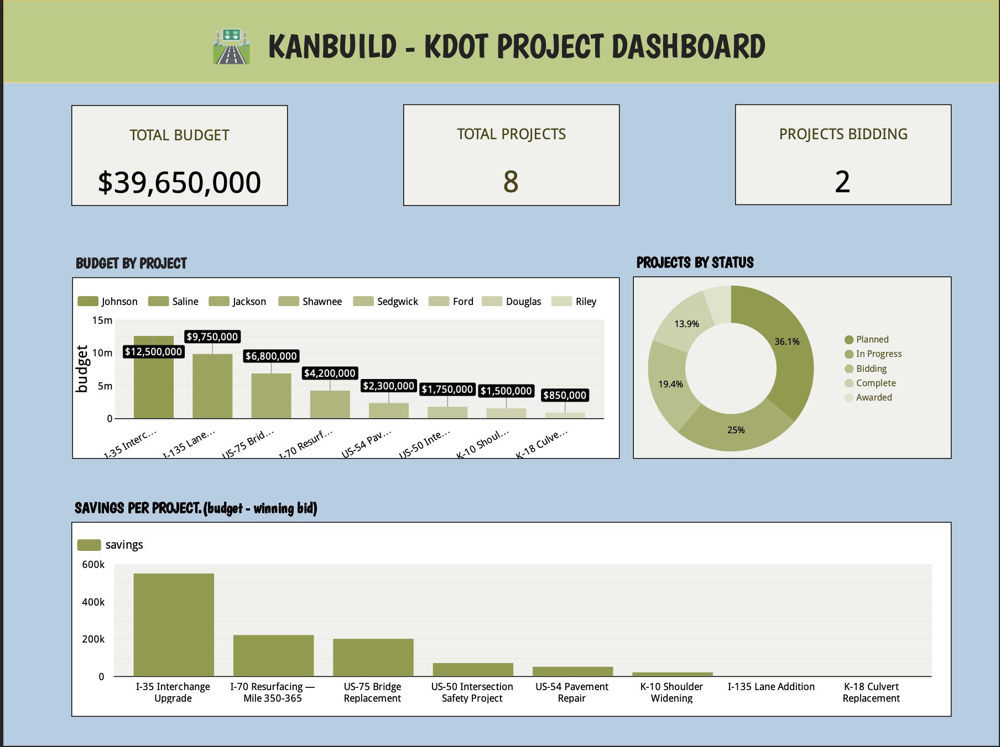

# 🛣️ KanBuild — Highway Construction Project & Bidding System

A small, **100% free** portfolio project that recreates — on a tiny
scale — **AASHTOWare Project**, the software state DOTs (like the
**Kansas Department of Transportation**) use to manage road
construction projects and contractor bids.

> A hands-on project I built to grow my skills in **SQL, databases,
> data analysis, reporting/BI, HTML, and the software development
> life cycle (SDLC)** — by building a real, end-to-end system.

### 🧱 What I built, step by step
1. **Designed a database** — created 5 related tables (projects, contractors, bids, materials) with keys and constraints.
2. **Loaded realistic sample data** — 8 highway projects, 10 contractors, and their bids.
3. **Wrote 20 SQL reports** — using JOINs, GROUP BY, subqueries, CTEs, CASE, and data-validation audits.
4. **Analyzed the data in Python** — used pandas to summarize the data and export a clean CSV.
5. **Built a web page** — an HTML/CSS/JavaScript page that lists projects and includes a bid form with validation.
6. **Created a BI dashboard** — connected the data to Google Looker Studio and built scorecards and charts.
7. **Documented everything** — wrote requirements, test cases, and a user guide, and published it all to GitHub.

---

## 📊 Live Dashboard

An interactive BI dashboard built in **Google Looker Studio** from this
project's data — showing budgets, project status, and savings per project.

**[▶ View the live dashboard →](https://datastudio.google.com/reporting/d2bb1150-ab37-44da-8e52-bd410689eb9a)**



The dashboard reports the same data the SQL queries produce:
- **Scorecards** — total budget ($39.65M), total projects (8), projects open for bidding (2)
- **Budget by Project** — each project's cost, colored by county
- **Projects by Status** — share of projects that are Planned, Bidding, In Progress, etc.
- **Savings per Project** — budget minus the winning bid (I-35 saved the most, ~$550K)

---

## 📖 About this project (in plain language)

**The real-world problem.** State transportation departments (DOTs) build
and repair thousands of miles of highways. For every project, multiple
construction companies (contractors) compete by submitting a **bid** — a
price they'll charge to do the work — and the DOT usually awards the job
to the **lowest qualified bidder**. Keeping track of all those projects,
bids, budgets, and materials is a huge data job. The software that does
this in real life is called **AASHTOWare Project**, and it's used by
nearly every state DOT in the U.S., including the **Kansas DOT (KDOT)**.

**What KanBuild does.** KanBuild is a tiny, easy-to-understand version of
that same idea. It stores a handful of **projects** (like "I-70
Resurfacing"), the **contractors** who bid on them, the **bids**
themselves, and the **materials** (asphalt, concrete, etc.) each project
uses. Then it answers the questions a DOT manager actually asks:

- Who submitted the **lowest bid** on each project?
- Did the winning bid come in **under or over budget**?
- How many projects are **open for bidding** right now?
- Which county has the **most road work** by dollars?
- Is any of our **data missing or wrong** (a quality check)?

**How it works, step by step.**
1. A **database** (SQLite) stores all the projects, contractors, bids, and materials in related tables.
2. A set of **SQL reports** pulls and analyzes that data to answer the questions above.
3. A **Python script** double-checks the data and exports a clean file (CSV) that can feed a dashboard.
4. A simple **web page** shows the project list and lets you submit a new bid.
5. **Documentation** (requirements, test cases, a user guide) wraps it all up like a real software project.

**Why it's built this way.** This mirrors the actual KDOT job — the role
is the technical person who keeps this kind of system running, writes the
reports, validates the data, and trains others to use it. So every part
of KanBuild maps to a real duty from the job description (see the table
below). And it's **100% free**: no paid software, no cloud accounts, no
credit card — everything runs right on your own computer.

> **Note:** All the data here is **made up** for learning. KanBuild is not
> affiliated with AASHTO, AASHTOWare, or KDOT — it's a personal practice
> project inspired by how their software works.

---

## 🎯 Why this project?
The real job is the technical lead for KDOT's project/bidding software.
This repo is a miniature version of that exact system — so it maps
directly to the job and makes a strong talking point in an interview.

## 🧩 How it covers every JD skill

| JD skill | Where it lives | What you do |
|----------|----------------|-------------|
| **SQL (30% of the job)** | `database/03_queries.sql` | 20 reports: JOINs, GROUP BY, subqueries, CTEs, CASE |
| **Database admin / design** | `database/01_schema.sql` | 5 related tables, keys, indexes, constraints |
| **Data validation** | Q17–Q19 + `analyze.py` | Audit queries for bad/missing data |
| **Reporting & BI** | `analysis/analyze.py` → CSV → Looker Studio | Export data and build a dashboard |
| **Data analysis** | `analysis/analyze.py` | Python + pandas summaries |
| **HTML / website updates** | `web/index.html`, `web/app.js` | Project list + bid form |
| **SDLC + testing** | `docs/` | Requirements → test cases → user guide |
| **Training / documentation** | `docs/user_guide.md` | Plain how-to guide |
| **AASHTOWare knowledge** | the whole concept | You can speak to bids, projects, materials |

## 🆓 Tools used (all free, no credit card)
- **SQLite** — the database (syntax ~matches the SQL Server / T-SQL KDOT uses)
- **Python + pandas** — data analysis (already installed on your Mac)
- **HTML / CSS / JavaScript** — the web page
- **Git / GitHub** — version control (optional next step)
- **Google Looker Studio** — free BI dashboard (optional next step)

---

## 🚀 Quick start
```bash
cd KanBuild

# 1. Build the database and print all 20 reports
bash database/build.sh

# 2. Run the Python data analysis (exports a CSV)
python3 analysis/analyze.py

# 3. Open the web page
open web/index.html        # or: python3 -m http.server 8000
```

## 📁 Project structure
```
KanBuild/
├── README.md                  ← you are here
├── database/
│   ├── 01_schema.sql          ← create the tables
│   ├── 02_sample_data.sql     ← realistic Kansas sample data
│   ├── 03_queries.sql         ← 20 SQL reports (your main practice)
│   └── build.sh               ← one command to build + run it all
├── analysis/
│   └── analyze.py             ← Python + pandas analysis → CSV
├── web/
│   ├── index.html             ← project list + bid form
│   └── app.js                 ← front-end logic
└── docs/
    ├── requirements.md        ← SDLC: plan
    ├── test_cases.md          ← SDLC: test
    └── user_guide.md          ← documentation / training
```

## 📚 Learning path (suggested order)
1. Read `docs/requirements.md` — understand what we're building.
2. Read `database/01_schema.sql` — see how the tables relate.
3. Run `bash database/build.sh` — watch the reports print.
4. Open `database/03_queries.sql` and run queries one at a time; tweak them.
5. Run `python3 analysis/analyze.py` — see Python analyze the same data.
6. Open `web/index.html` — try the bid form.
7. Work through `docs/test_cases.md` — mark each test Pass/Fail.
8. (Stretch) Build a Looker Studio dashboard from the exported CSV.

---
*Demo project for KDOT Management Analyst II skill prep. All data is fictional.*
